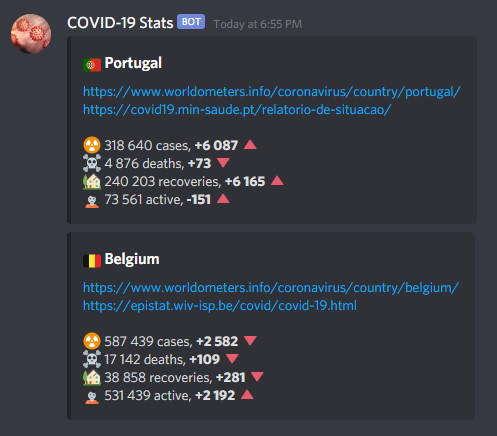
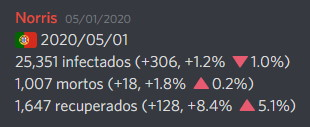
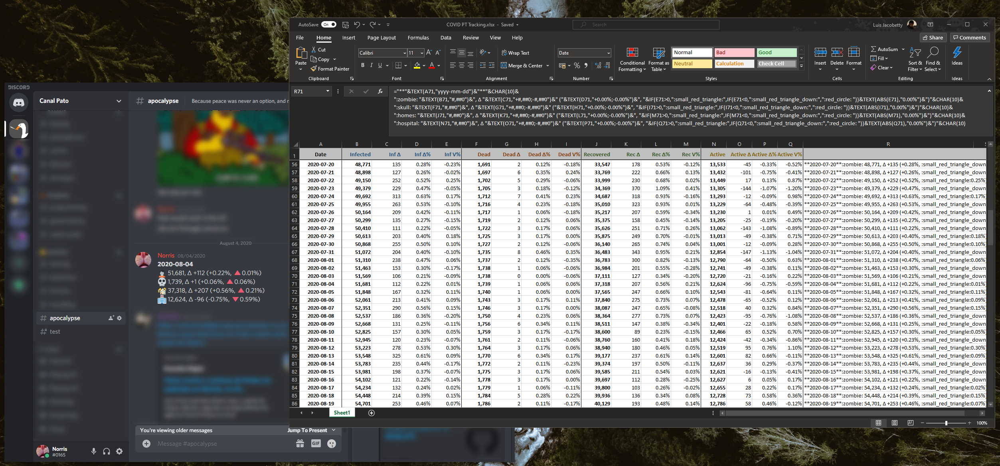
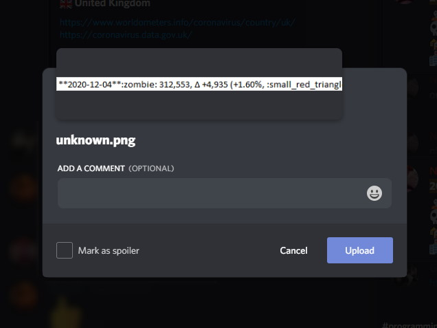

# COVID-19 Info Scraper

This is a small app that scrapes data from a given URL (thank you, [Worldometer](https://www.worldometer.info)), extracts the required numbers, and sends an update to a Discord channel via webhook.

## How to use

- Clone the repo;
- Configure a `.env` file, and a Discord webhook (check out `.env-sample` for a template);
- Tweak the config object in `index.js` to suit your needs;
- Run `npm install`;
- Run `npm sandbox`.

## Motivation

I publish COVID-19 stats from my country on a Discord channel, so that me and my friends can be up to date with the latest numbers. This started during the early days of the pandemic, and it has been an effort to keep at it everyday.

Initially all of the math and number-crunching was achieved manually. Yes, even the percentages.

_Doing math everyday was stimulating, but ultimately boring._

A few months later I migrated to an Excel sheet where I'd paste the three relevant values, and the math would be accomplished automatically, as well as the string to paste on Discord.

_More lines pls._

Both of these approaches have ultimately shown problems:

1. I need to always check and copy/paste numbers by hand.
2. Depending on the source, numbers are formatted differently, which Excel doesn't like... not to mention the formatting going all wrong if I don't paste the value in the right place.
3. I can't copy-paste the final cell directly to Discord, otherwise it'll try to upload as an image...

_NANI?!_

I've also been out of the Javascript/Typescript game for a while, and I needed an exercise to flex those brain cells... so here we are.

## Contributing

Why would you...?

I mean, thank you for the interest, and feel free to open issues/PRs/fork/etc. Just know there are much better thought-out apps out there for this purpose.
